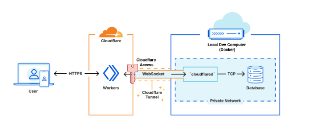
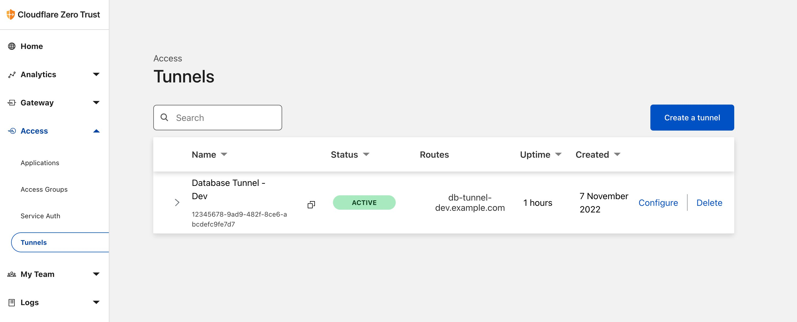
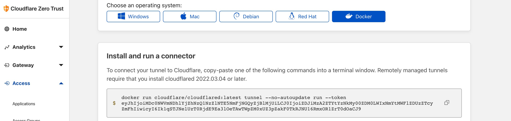
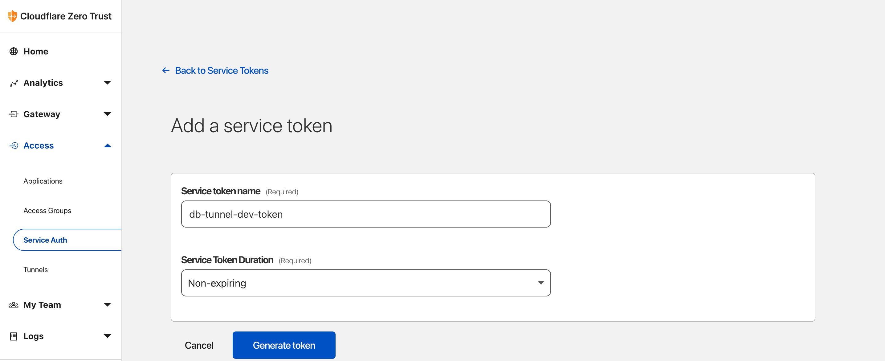
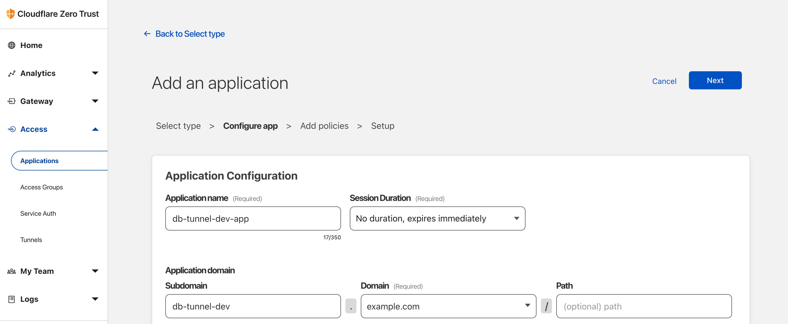
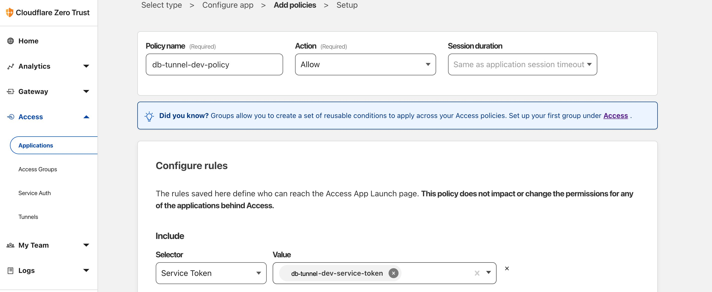
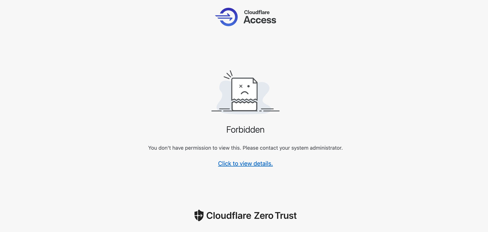
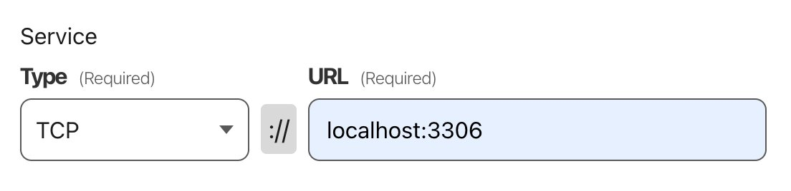
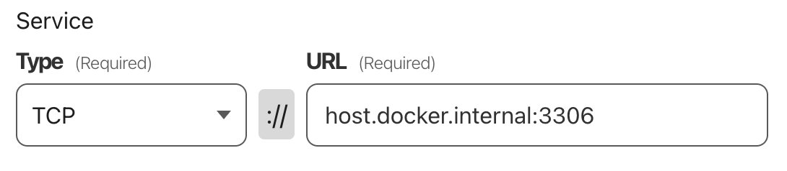

# Working Example of Cloudflare Worker and Self-Hosted MySQL

## Purpose

To connect a Cloudflare Worker **securely** to a self-hosted origin database server.


## Intro

Exposing your database on the public Internet is a security risk.  Malicious actors search the Internet for open database ports and attempt brute-force user/password attacks to gain access to your sensitive or proprietary data.

This risk can be mitigated by blocking database access to the Internet and instead, employing a secure tunnel between Cloudflare Worker and your database.

This repo is a working improvement on the [worker-mysql](https://github.com/cloudflare/templates/tree/main/worker-mysql) repo from Cloudflare Workers Team, which I was unable to secure with Cloudflare Tunnel and Cloudflare Access.  

This repo runs Cloudflare Tunnel (`cloudflared` service) and MySQL database locally, in a Docker container.  These will work on a remote server too.  This example can be modified to support Postgres databases by making the same changes to the Postgres database driver.

Cloudflare Tunnels are [now free](https://blog.cloudflare.com/tunnel-for-everyone/).

## Features

- Wranger 2.0
- TypeScript
- Cloudflare Worker
- Supports local development
- Self-hosted MySQL Database (remote or local)
- Cloudflare Tunnel using dockerised Cloudflared service
- Cloudflare Application to secure Cloudflare Tunnel with Cloudflare Access Service Token
- MySQL Client/Driver with Cloudflare Access Service Token (`CF_CLIENT_ID`, `CF_CLIENT_SECRET`)
- Implements the new ES module / Module worker (instead of Service Workers)
- Secret environment variables

## Component Diagram



## Prerequisites

### 1. Docker

[Docker](https://www.docker.com/) for running `cloudflared` and MySQL locally.  

If using Mac or PC, Docker Desktop is a good choice.

### 2. Node Version Manager

[Node Version Manager](https://github.com/nvm-sh/nvm) to run the correct version of Node.  

Run `nvm install` to install the required Node version on your local development environment.  

Then run `nvm use` in each terminal window to use the required Node version.

### 3. Cloudflare Website

You will need a Cloudflare Site/Website setup in the [Cloudflare dashboard](https://dash.cloudflare.com/).  Follow these [setup instructions](https://developers.cloudflare.com/fundamentals/get-started/setup/add-site/).

## Setup

_This example uses the **example.com** domain.  Please substitute with your own domain._
### 1. Cloudflare Tunnel

Via the Cloudflare UI, create a tunnel between Cloudflare Worker and dockerised MySQL database.

MySQL will be running within a Docker container, therefore from the perspective of `cloudflared` the MySQL hostname/IP is `host.docker.internal`, the Docker VMs IP.  The MySQL port is `3306`.

- Visit the [Cloudflare Zero Trust Dashboard](https://one.dash.cloudflare.com/), which differs from the standard dashboard.
- Select "Access" > "Tunnels".
- Click "Create a Tunnel" button.
- Provide a descriptive name eg "Database Tunnel - Dev".
- Provide a public hostname eg "db-tunnel-dev.example.com"
    - Subdomain eg "db-tunnel-dev"
    - Domain - select your Cloudflare website from the dropdown eg "example.com"
    - Path - empty
    - Service eg "tcp://host.docker.internal:3306"
        - Type: "tcp"
        - URL: "host.docker.internal:3306" 

Note, if you're NOT running MySQL within Docker, use Service: `tcp://127.0.0.1:3306`.

_Ignore warnings regarding DNS entry not existing.  This will automatically create a DNS CNAME on the domain, pointing to your Tunnel._



The status of your newly created tunnel will not show as "Active" yet.  It will become active once you've setup and started `cloudflared` in the next step.

References:
- [Cloudflare's Tunnel Setup Guide](https://developers.cloudflare.com/cloudflare-one/connections/connect-apps/install-and-setup/tunnel-guide/remote/#set-up-a-tunnel-remotely-dashboard-setup)

### 2. Cloudflared

From the CLI, login to Cloudflare to authorise the Cloudflare Tunnel.  You will be asked to open a link in your browser.  Run `npm run cloudflared:login`

Running this command will generate and copy a certifcate to `/home/nonroot/.cloudflared/cert.pem`.  In this example, you do not need to move the cert but may need to copy it to a remote server at a later time should you want to use this tunnel on a remote server.

The `cloudflared` service will need to run within your own server's private network.  In most situations, `cloudflared` will run on the same server as your database server, but it can run on a separate server within your private network.  In this example, `cloudflared` will run within a Docker container alongside MySQL on your local development computer (127.0.0.1, host.docker.internal).

Important note: if you're running `cloudflared` within Docker and NOT running MySQL within Docker, use Service: `tcp://127.0.0.1:3306`.  By default, Docker containers cannot make outbound network calls to host (127.0.0.1) ports - therefore Cloudflare cannot reach MySQL running on the host (127.0.0.1).  Setup Cloudflared to run on the same network as the host by adding `network_mode: host` to the [docker-compose.yml](./docker-compose.yml) file (see commented out line).

Modify [docker-compose.yml](./docker-compose.yml) environment variables to include the Cloudflare Tunnel's token from the Cloudflare Tunnel dashboard:
```
TUNNEL_TOKEN=""
```

You can find the token on [Cloudflare Zero Trust](https://one.dash.cloudflare.com/) dashboard under "Access" > "Tunnels":



Once `TUNNEL_TOKEN` has been populated, the `cloudflared` Docker container can be started with `npm run cloudflared`.  This will also start the MySQL container as they're linked in the `docker-compose.yml`.

Reference: 
- [Cloudflared Docker image](https://hub.docker.com/r/cloudflare/cloudflared).


### 3. Cloudflare Service Tokens

A Service Token is required to secure the Tunnel from the public.  The Service Token is stored in the Cloudflare Worker and Cloudflare Application, which we'll setup in the next step.

Create Service Tokens on [Cloudflare Zero Trust](https://one.dash.cloudflare.com/) dashboard under "Access" > "Service Auth":

Click "Create Service Token" and provide a meaningful name (eg "db-tunnel-dev-service-token") and expiry date.



You will be presented with `CF_CLIENT_ID` and `CF_CLIENT_SECRET`.  Copy the secret and treat it as a sensitive password.

These will be needed by your Cloudflare Worker to authenticate on the Cloudflare Tunnel.

### 4. Cloudflare Application

Secure the tunnel from malicious actors by restricting who can hit your Cloudflare Tunnel's hostname.

Create Application on [Cloudflare Zero Trust](https://one.dash.cloudflare.com/) dashboard under "Access" > "Applications":

- Step 1:
    - Click "Create an Application" button.
    - Select "Self-Hosted" as the type of application you'll be tunnelling to.
    - Application name eg "db-tunnel-dev-app"
    - Application domain eg "db-tunnel-dev.example.com"
        - Subdomain eg "db-tunnel.dev"
        - Domain eg "example.com" - Dropdown list of your Cloudflare Websites.
- Step 2:
    - Policy name eg "db-tunnel-dev-policy"
    - Action: "Service Auth"
    - Configure rules:
        - Include selector: "Service Token"
        - Include value (Service Token) eg "db-tunnel-dev-service-token" - The Service Token create in the previous step.

**Step 1:**


**Step 2:**


### 5. Cloudflare Worker

All communication through the Cloudflare Tunnel needs to include the Service Token in request headers when communicating through the tunnel:
```
CF-Access-Client-Id: e9dbd31ad.....98bf458b4.access
CF-Access-Client-Secret: 09725548845e2edaea70.......27e03a3785e39c59a50
```

This exercise ensures that the MySQL client sends the above headers when it communicates with the origin server (your local dockerised MySQL) via the Cloudflare Tunnel.  The MySQL client has appended the above headers to each request.

`CF-Access-Client-Id` and `CF-Access-Client-Secret` contain the values from the environment variables `CF_CLIENT_ID` and  `CF_CLIENT_SECRET` respectively.  These environment variables were created when the Cloudflare Service Token was generated above.

Whilst `CF_CLIENT_ID` and `CF_CLIENT_SECRET` can be added to [./wrangler.toml](wrangler.toml) in plain text, it's more secure to persist these values in Wrangler Secrets on the command line:

```sh
npx wrangler secret put CF_CLIENT_ID
npx wrangler secret put CF_CLIENT_SECRET
```

When persisted in Secrets environment variables, these will be automatically available to your Workers when published.

### 6. Running Example Cloudflare Worker

- `npm install`
- Update the Tunnel Host in [wrangler.toml](./wrangler.toml) to the Cloudflare Tunnel hostname defined in an earlier step eg `db-tunnel-dev.example.com`.  The protocol is "https", not "tcp":
    ```toml
    [vars]
    TUNNEL_HOST = "https://db-tunnel-dev.example.com"
    ```
- Ensure [docker-compose.yml](./docker-compose.yml) contains your `TUNNEL_TOKEN` from an earlier step.
- `npm run dev`

If everything has been setup correctly, visiting https://db-tunnel-dev.example.com in the browser should return a Cloudflare Access `401 Forbidden` page.  This is because you haven't made th request with a valid Cloudflare Service Token (`CF-Access-Client-Id` and `CF-Access-Client-Secret` headers).

Request public DB endpoint (https://db-tunnel-dev.example.com) from browser, without Service Token, will result in the request being blocked (hooray!):



### 7. Secure Your Self-Hosted Database

The steps above have established a secure tunnel which provides a secure doorway into your **private network**.   Make sure your MySQL database is in your private network and not public network, accessible directly on the Internet.

Implement a firewall on your local develoment computer (or server) to ensure MySQL's port 3306 is not accessible to the Internet.  If it is accessible over the Internet, it is open to malicious actors and needs to be secured.

There is no point implementing a tunnel to your MySQL database if it's accessible directly over the Internet.


## Running

1. Start `cloudflared` and MySQL Docker containers: `npm run cloudflared`.  
2. Run Cloudflare Worker locally using Miniflare:  `npm run dev`
3. Visit [http://localhost:8787](http://localhost:8787)

## Troubleshooting

### Problem using `globalThis`

> ERROR: CF_CLIENT_ID is not defined.
> Attempted to access binding using global in modules.
> You must use the 2nd env parameter passed to exported handlers/Durable Object constructors, or context.env with Pages Functions.

When using Module Workers, do not use the `globalThis` variable.  

This restrictions was introduced in this [commit on Miniflare](https://github.com/cloudflare/miniflare/blob/e5a0231a5695c4d3689a66f1619bbbf657a6260f/packages/core/src/standards/event.ts#L189).

Learn the difference between Service Workers and Module Workers on this [blog post](https://blog.cloudflare.com/workers-javascript-modules/).
#### Don't

```ts
// Module Worker format
export default {
  async fetch(request: Request, env: Env, ctx: ExecutionContext) {
    globalThis.CF_CLIENT_ID = env.CF_CLIENT_ID || undefined
    console.log(globalThis.CF_CLIENT_ID)  // <-- will error!
  }
}    
```

#### Do

```ts
// Module Worker format
export default {
  async fetch(request: Request, env: Env, ctx: ExecutionContext) {
    console.log(env.CF_CLIENT_ID) // Use `env` directly and pass through app. 
  }
}    
```

### Top-level Await

> ✘ [ERROR] Top-level await is not available in the configured target environment ("es2020")

The original [worker-mysql](https://github.com/cloudflare/templates/tree/main/worker-mysql) no longer works with top-level awaits (TLAs).  The TLAs need to be wrapped.

#### Don't
```ts
await setup(DEFAULT_CONFIG);
```

#### Do
```ts
(async () => {
  await setup(DEFAULT_CONFIG);
})();
```

### Localhost vs Docker

**127.0.0.1**
> cloudflared-tunnel  | 2022-11-09T16:43:47Z ERR  error="dial tcp 127.0.0.1:3306: connect: connection refused" cfRay=767802675b1472e2-LHR ingressRule=0 originService=tcp://127.0.0.1:3306

or

**localhost**
> cloudflared-tunnel  | 2022-11-09T16:43:47Z ERR  error="dial tcp localhost:3306: connect: connection refused" cfRay=767802675b1472e2-LHR ingressRule=0 originService=tcp://localhost:3306


When `cloudflared` and MySQL are both running within a Docker container, the IP address for `cloudflared` to reach the MySQL container is Docker's internal IP address, accessible via the hostname `host.docker.internal`.

Ensure the Public Hostname for the tunnel is pointing to an IP/hostname accessible to `cloudflared`. [Cloudflare Zero Trust](https://one.dash.cloudflare.com/) dashboard under "Access" > "Tunnels" > your tunnel > "Public Hostname".

#### Don't



#### Do



## Cannot Connect Cloudflared to MySQL (not in Docker container)

### Error Log

```
ERR Request failed error="dial tcp 127.0.0.1:3306: connect: connection refused" connIndex=0 dest=<HOST_NAME> ip=<IP_ADDRESS> type=ws
```

### Resolution

By default, Docker containers cannot make outbound network calls to host (127.0.0.1) ports, therefore Cloudflare cannot reach MySQL running on the host.  Setup Cloudflared to run on the same network as the host by adding `network_mode: host` to the [docker-compose.yml](./docker-compose.yml) file (see commented out line).

## Contributions and Feedback

Feel free to contribute through PR and raising issues.